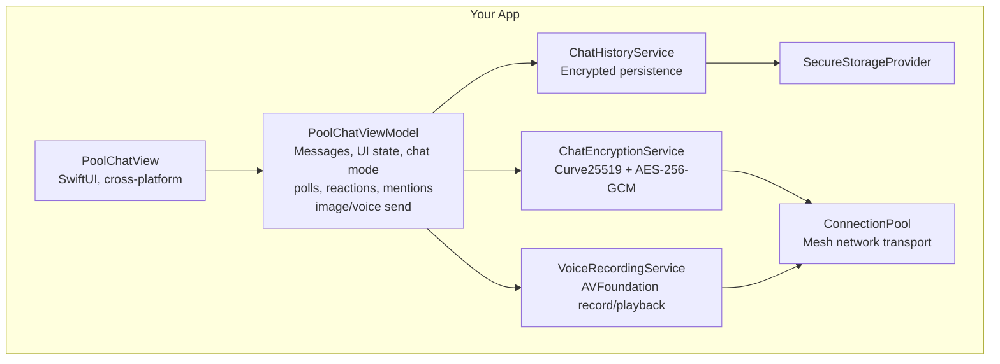

# Architecture

[Back to README](../README.md)

## Contents

- [Component Layout](#component-layout)
- [Message Flow (Send)](#message-flow-send)
- [Message Flow (Receive)](#message-flow-receive)
- [Package Structure](#package-structure)

## Component Layout



## Message Flow (Send)

1. User composes a message in `PoolChatView`
2. `PoolChatViewModel` creates a `RichChatMessage` and strips image metadata if applicable
3. Message is serialized to `RichChatPayload` (or `PrivateChatPayload` for DMs)
4. `ChatEncryptionService` encrypts the payload with the recipient's shared AES-256-GCM key
5. Encrypted payload is wrapped in `EncryptedChatPayload` and sent via `ConnectionPoolManager`
6. `ChatHistoryService` persists the message through `SecureStorageProvider`

## Message Flow (Receive)

1. `ConnectionPoolManager` delivers an incoming `PoolMessage`
2. `PoolChatViewModel` unwraps the `EncryptedChatPayload`
3. `ChatEncryptionService` decrypts using the sender's shared key
4. Decrypted payload is deserialized into a `RichChatMessage` and displayed
5. If the chat window is closed, `ChatNotificationBridge` sends a local notification

## Package Structure

```
PoolChat/
├── Package.swift
└── Sources/
    ├── PoolChat.swift                          # Module exports
    ├── Configuration/
    │   └── PoolChatConfiguration.swift         # Dependency injection
    ├── Models/
    │   └── RichChatMessage.swift               # All message and payload types
    ├── Protocols/
    │   ├── PoolChatLogger.swift                # Logging protocol + default
    │   ├── SecureStorageProvider.swift         # Encrypted storage protocol
    │   └── PoolChatAppLifecycle.swift          # App lifecycle management
    ├── Services/
    │   ├── ChatEncryptionService.swift         # E2E encryption + TOFU
    │   ├── ChatHistoryService.swift            # Encrypted history persistence
    │   ├── ChatNotificationService.swift       # Local notification delivery
    │   ├── ChatNotificationBridge.swift        # Background notification bridge
    │   └── VoiceRecordingService.swift         # Voice record and playback
    ├── Calling/
    │   ├── Models/
    │   │   ├── CallSession.swift               # Call state and participants
    │   │   ├── CallSignal.swift                # Signaling frames over the pool
    │   │   └── MediaFrame.swift                # Audio/video frame envelope
    │   ├── Services/
    │   │   ├── CallManager.swift               # Call lifecycle coordination
    │   │   ├── AudioCallService.swift          # Audio capture and playback
    │   │   ├── VideoCallService.swift          # Video capture and rendering
    │   │   └── MediaEncryptionService.swift    # Per-call media key derivation
    │   └── Views/
    │       ├── ActiveCallView.swift            # In-call UI
    │       ├── IncomingCallView.swift          # Ringing UI
    │       ├── CallButtonsView.swift           # Mute/camera/hangup controls
    │       └── VideoTileView.swift             # Per-participant video tile
    ├── ViewModels/
    │   └── PoolChatViewModel.swift             # Chat state management
    └── Views/
        └── PoolChatView.swift                  # SwiftUI chat interface
```

## Related Documents

- [Security](Security.md) for the encryption pipeline and threat model
- [API Reference](APIReference.md) for the types named above
